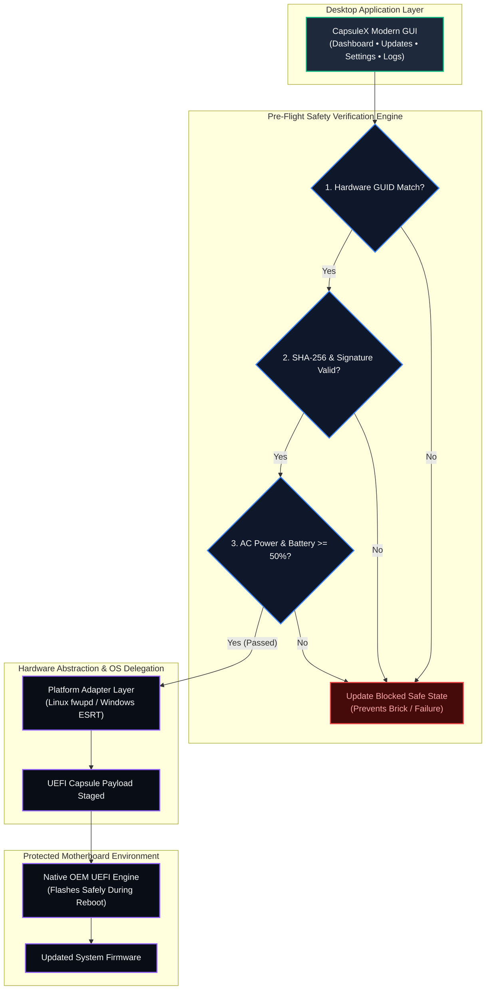
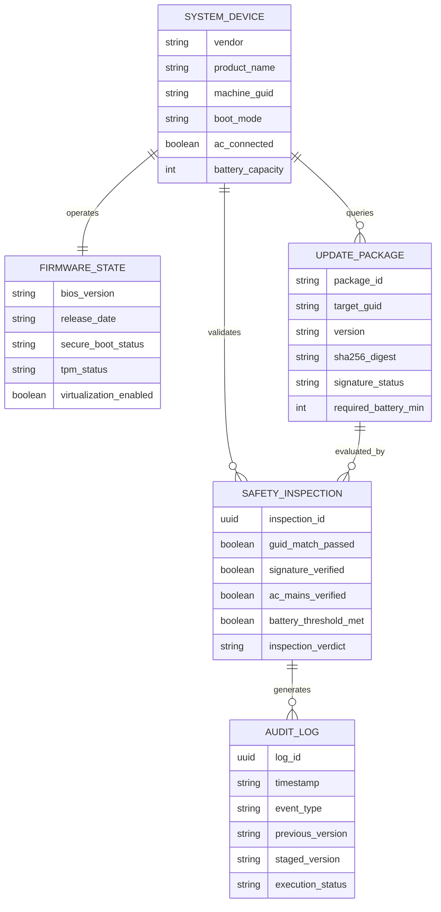

# CapsuleX

[](https://github.com/abdulwalidal/capsulex/actions/workflows/ci.yml)
[](LICENSE)
[](https://openjdk.org/)
[](https://www.formdev.com/flatlaf/)
[](CONTRIBUTING.md)
[](SECURITY.md)

A modern, universal, and risk-free desktop firmware management console designed to simplify UEFI/BIOS inspection, updates, and diagnostics with automated pre-flight safety verification.

---

## Why CapsuleX?

Managing motherboard firmware (BIOS/UEFI) has traditionally been an intimidating and risky chore for computer owners. Users are forced to navigate fragmented manufacturer support pages, parse cryptic technical jargon, format USB flash drives, and risk permanently bricking their hardware if an update fails.

**CapsuleX transforms this into a safe, transparent, and user-friendly experience:**
- **Zero-Brick Architecture**: CapsuleX strictly enforces delegated firmware execution. It **never writes directly to SPI flash chips**. Updates are safely staged into verified UEFI Capsules and handed to OEM firmware mechanisms.
- **Automated Pre-Flight Inspection**: Mandatory multi-factor safety checklist prevents updates unless AC mains power is connected, battery is $\ge 50\%$, and digital signatures are verified.
- **Vendor-Agnostic Simplicity**: One unified interface for Dell, Lenovo, HP, ASUS, and custom systems.
- **Embedded Knowledge Engine**: Every setting and security parameter includes clean, professional system descriptions—no gaming analogies, no cryptic acronyms, just clear technical facts.
- **Safe Simulation Sandbox**: Practice and test update workflows and failure modes in a risk-free virtual simulator.

---

## Core Highlights

- **Live System Telemetry (100% Read-Only)**: Instantly inspects Motherboard identification, current BIOS revision, release date, Secure Boot status, TPM 2.0 readiness, and CPU Virtualization extensions.
- **Pre-Flight Safety Verification**: Live multi-point checklist verifying AC power, reserve battery capacity, payload integrity, and device GUID matching.
- **Firmware Settings Guidance**: View and toggle supported firmware attributes with guided pre-boot authorization workflows.
- **Diagnostics & Audit History**: Local, persistent audit log documenting every firmware update event, status outcome, and version jump.
- **Privacy by Design**: Purely local execution. Zero telemetry, zero background trackers, and zero third-party data collection.

---

## How It Protects Your System



1. **Inspect**: Safely query current BIOS version, Secure Boot, and platform telemetry.
2. **Verify**: Pre-flight safety engine confirms AC power, battery reserve, and cryptographic signatures.
3. **Stage**: Firmware is handed to the official UEFI capsule mechanism for safe flashing upon reboot.

---

## Firmware Data Architecture (ERD)

The following Entity-Relationship Diagram outlines the core data domain and inspection relationships managed by CapsuleX:



---

## Quick Start Guide

### Prerequisites
- **Java**: OpenJDK 21 LTS or higher
- **Linux** (Debian, Ubuntu, Fedora, Arch) or **Windows 10/11**

### Setup and Run

```bash
# 1. Clone the repository
git clone git@github.com:abdulwalidal/capsulex.git
cd capsulex

# 2. Compile and package executable JAR
./mvnw clean package

# 3. Launch CapsuleX desktop console
java -jar target/capsulex-0.1.0.jar
```

---

## Open Source Governance and Documentation

CapsuleX is built according to open-source best practices:

| Document | Purpose |
| :--- | :--- |
| [**Architecture & Security**](ARCHITECTURE.md) | In-depth system design, component boundaries, and threat model. |
| [**Roadmap**](ROADMAP.md) | Project milestones from `v0.1.0` to production `v1.0.0`. |
| [**Contributing Guidelines**](CONTRIBUTING.md) | Trunk-based pull request workflow and Conventional Commits. |
| [**Security Policy**](SECURITY.md) | Zero-brick commitment and responsible vulnerability reporting. |
| [**Code of Conduct**](CODE_OF_CONDUCT.md) | Contributor Covenant v2.1 community standards. |
| [**License**](LICENSE) | Permissive open-source MIT License. |

---

## License

This project is licensed under the terms of the [MIT License](LICENSE).
